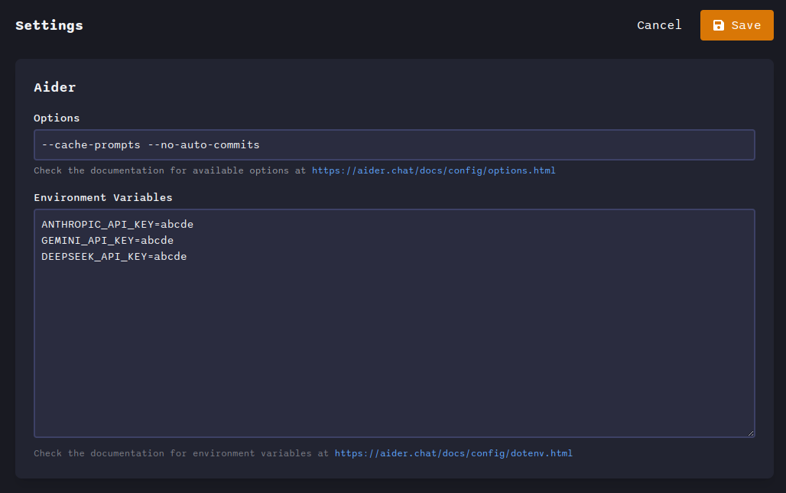
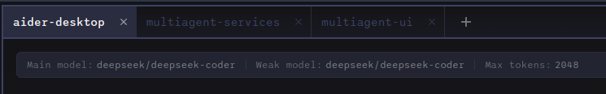
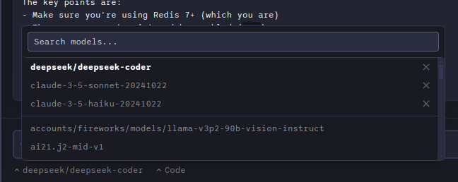
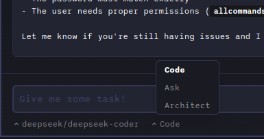
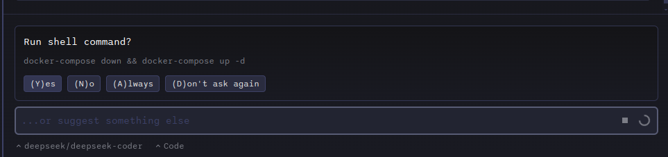

# aider-desk

Supercharge your coding workflow with aider-desk, a sleek desktop application that brings the power of **aider** to your fingertips. Say hello to a user-friendly GUI, enhanced with project management, cost tracking, and structured message handling. Effortlessly leverage language models to accelerate your code-related tasks and boost your productivity.

## Quick Demo

[](https://www.youtube.com/watch?v=9JkUwn9rk2g)

## Features

This tool provides features you are familiar with from Aider and additionally:

*   **Graphical User Interface (GUI):**
    *   Enjoy a user-friendly desktop application with a visual interface, replacing the command-line experience.
*   **Project Management:**
    *   Organize and manage multiple codebases as separate projects, allowing for better context and organization.
    *   Easily switch between different projects.
*   **IDE Integration:**
    *   Seamlessly integrate with IntelliJ IDEA and VSCode to automatically manage context files
    *   [IntelliJ IDEA Plugin](https://github.com/hotovo/aider-desk-connector-intellij-plugin)
    *   [VSCode Extension](https://github.com/hotovo/aider-desk-connector-vscode-extension)
*   **Manage Environment Variables:**
    *   Manage environment variables for model API keys and others
*   **Cost Tracking:**
    *   Monitor token usage and costs associated with AI interactions, providing transparency and control over expenses.
    *   Gain insights into the expenses of using language models.
*   **Structured Message Handling:**
    *   View different types of messages (code, prompts, responses, logs, command outputs) in a clear and organized manner, enhancing readability and understanding.
*   **Enhanced File Management:**
    *   Visually add, remove, and manage files within the project context, providing more control over the AI's context.
*   **Flexible Model Switching:**
    *   Easily switch between different language models during a single session
    *   Maintain conversation context when switching models
*   **Code Diff Viewer:**
    *   Easily review AI-generated code changes with an integrated diff viewer
    *   Side-by-side comparison of original and modified code
*   **Revert Changes:**
    *   Undo specific AI-generated changes with a single click
    *   Revert changes that don't meet your expectations while keeping other modifications
*   **Copy and Share:**
    *   Quickly copy messages or code changes to clipboard with a single click
    *   Share specific code changes or conversations with team members

## Installation

### Requirements
- Python 3.8-3.13 installed on your system

### Quick Start
1. Download the latest release for your platform from [Releases](https://github.com/hotovo/aider-desk/releases)
2. Run the downloaded executable

### Development Setup
If you want to run from source (or there is no executable for your platform), you can follow these steps:

```bash
# Clone the repository
$ git clone https://github.com/hotovo/aider-desk.git
$ cd aider-desk

# Install dependencies
$ npm install

# Run in development mode
$ npm run dev

# Build executables
# For Windows
$ npm run build:win

# For macOS
$ npm run build:mac

# For Linux
$ npm run build:linux
```

## Screenshots

### Aider Desk Interface

*Main application interface showing the chat interface, file management, and project overview*

### Configuration

*Aider settings and preferences*

### Multiple Project Management

*Managing and switching between multiple projects*

### Context File Management

*Managing files included in the AI context*

### Model Switching Interface

*Switching between different AI models*

### Chat Mode Selection

*Switching between different chat modes*

### Question answering and commands running support

*Answering questions and running commands*

### Code Diff Viewer

*Side-by-side code comparison and diff viewer*

### Cost Tracking

*Token usage and cost tracking for session per project*

## Contributing

We welcome contributions from the community! Here's how you can help improve aider-desk:

1. **Fork the repository** on GitHub
2. **Create a new branch** for your feature or bugfix:
   ```bash
   git checkout -b my-feature-branch
   ```
3. **Commit your changes** with clear, descriptive messages
4**Push your branch** to your fork
5**Create a Pull Request** against the main branch of the original repository

Please follow these guidelines:
- Keep PRs focused on a single feature or bugfix
- Update documentation when adding new features
- Follow the existing code style and conventions
- Write clear commit messages and PR descriptions

For major changes, please open an issue first to discuss what you would like to change.
