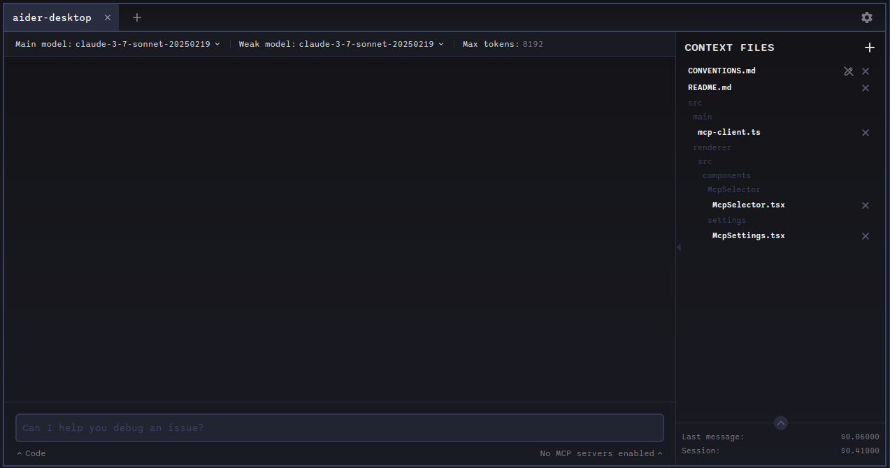

# ✨ AiderDesk

**Supercharge your coding workflow** with AiderDesk, a sleek desktop application that brings the power of [aider](https://aider.chat) to your fingertips with a modern GUI. Leverage AI to accelerate your coding tasks while enjoying seamless project management, cost tracking, and IDE integration.

## 🚀 Introduction

Transform your AI coding experience with AiderDesk - all the power of the Aider console tool in an intuitive desktop interface. Whether you're managing multiple projects, integrating with your favorite IDE, or tracking costs, AiderDesk elevates your productivity to new heights.


## 🎬 Quick Demo

<div align="left">
  <a href="https://www.youtube.com/watch?v=9JkUwn9rk2g">
    
  </a>
</div>

## ✨ Key Features

*   **🖥️ Intuitive GUI** - Replace command-line complexities with a sleek visual interface
*   **📂 Project Management** - Organize and switch between multiple codebases effortlessly
*   **🔌 IDE Integration** - Automatically manage context files in:
    * IntelliJ IDEA ([Plugin](https://plugins.jetbrains.com/plugin/26313-aiderdesk-connector) | [GitHub](https://github.com/hotovo/aider-desk-connector-intellij-plugin))
    * VSCode ([Extension](https://marketplace.visualstudio.com/items?itemName=hotovo-sk.aider-desk-connector) | [GitHub](https://github.com/hotovo/aider-desk-connector-vscode-extension))
*   **🧩 MCP Support** - Connect to Model Context Protocol servers for enhanced AI capabilities
*   **🔑 Settings Management** - Easily configure API keys and environment variables
*   **💰 Cost Tracking** - Monitor token usage and expenses with detailed insights
*   **📨 Structured Messages** - View code, prompts, and outputs in a clear, organized manner
*   **📄 Visual File Management** - Add, remove, and manage context files with ease
*   **🔄 Model Switching** - Seamlessly switch between different AI models while preserving context
*   **🔍 Code Diff Viewer** - Review changes with side-by-side comparison
*   **⏪ One-Click Reverts** - Undo specific AI-generated changes while keeping others
*   **📋 Easy Sharing** - Copy and share code changes or conversations instantly

## 📥 Installation

### 📋 Requirements
- Python 3.9-3.12 installed on your system

### 🚀 Quick Start
1. Download the latest release for your platform from [Releases](https://github.com/hotovo/aider-desk/releases)
2. Run the downloaded executable

### 🔧 Troubleshooting

#### 🐍 Python Version Detection

If you encounter issues with the application not detecting the correct Python version, you can specify the path to the desired Python executable using the `AIDER_DESK_PYTHON` environment variable. This is typically only needed on the initial run/setup of AiderDesk.

For example, on macOS or Linux:

```bash
export AIDER_DESK_PYTHON=/usr/bin/python3.10
```

Or on Windows:

```powershell
$env:AIDER_DESK_PYTHON = "C:\Path\To\Python310\python.exe"
```

Replace `/usr/bin/python3.10` or `C:\Path\To\Python310\python.exe` with the actual path to your Python executable.

#### 🚫 Disabling Auto Updates

If you want to disable automatic updates, you can set the `AIDER_DESK_NO_AUTO_UPDATE` environment variable to `true`. This is useful in environments where you want to control when updates are applied.

For example, on macOS or Linux:

```bash
export AIDER_DESK_NO_AUTO_UPDATE=true
```

Or on Windows:

```powershell
$env:AIDER_DESK_NO_AUTO_UPDATE = "true"
```

## 📸 Screenshots

<div align="center">

### 🖥️ Aider Desk Interface

<p><em>Main application interface showing the chat interface, file management, and project overview</em></p>

### ⚙️ Configuration

<p><em>Aider settings and preferences</em></p>

### 📂 Multiple Project Management

<p><em>Manage and switch between multiple projects</em></p>

### 📄 Context File Management

<p><em>Manage files included in the AI context</em></p>

### 🔄 Model Switching Interface

<p><em>Switch between different models</em></p>

### 💬 Chat Mode Selection

<p><em>Switch between different chat modes</em></p>

### 🤖 Question Answering and Commands

<p><em>Answer questions and run commands</em></p>

### 🔍 Code Diff Viewer

<p><em>Side-by-side code comparison and diff viewer</em></p>

### 💰 Cost Tracking

<p><em>Token usage and cost tracking for session per project</em></p>

### 🛠️ MCP Server Integration

<p><em>Configure and manage Model Context Protocol servers for enhanced AI capabilities</em></p>

</div>

## 🛠️ Model Context Protocol (MCP) Support (Experimental)

AiderDesk integrates with the [Model Context Protocol](https://github.com/model-context-protocol/mcp) (MCP), enhancing your coding workflow with external tools and context:

### What is MCP?

MCP connects AI models to external tools like web browsers, documentation systems, and specialized programming utilities. AiderDesk can use these tools to gather information, then pass the results to Aider for implementing actual code changes.

### Key Features:

- **Tool Integration**: Connect to browsers, documentation systems, and language-specific tools
- **Provider Options**: Choose between OpenAI and Anthropic models
- **Flexible Configuration**: Enable/disable servers, customize settings, and control usage
- **Seamless Workflow**: MCP tools gather information, then Aider implements the code changes

AiderDesk should work with any MCP-compatible server, including Brave API MCP server for searching the web and custom language-specific tools.

## 👨‍💻 Development Setup
If you want to run from source, you can follow these steps:

```bash
# Clone the repository
$ git clone https://github.com/hotovo/aider-desk.git
$ cd aider-desk

# Install dependencies
$ npm install

# Run in development mode
$ npm run dev

# Build executables
# For Windows
$ npm run build:win

# For macOS
$ npm run build:mac

# For Linux
$ npm run build:linux
```

## 🤝 Contributing

We welcome contributions from the community! Here's how you can help improve aider-desk:

1. **Fork the repository** on GitHub
2. **Create a new branch** for your feature or bugfix:
   ```bash
   git checkout -b my-feature-branch
   ```
3. **Commit your changes** with clear, descriptive messages
4. **Push your branch** to your fork
5. **Create a Pull Request** against the main branch of the original repository

Please follow these guidelines:
- Keep PRs focused on a single feature or bugfix
- Update documentation when adding new features
- Follow the existing code style and conventions
- Write clear commit messages and PR descriptions

For major changes, please open an issue first to discuss what you would like to change.

## ⭐ Star History

[](https://star-history.com/#hotovo/aider-desk&Date)
