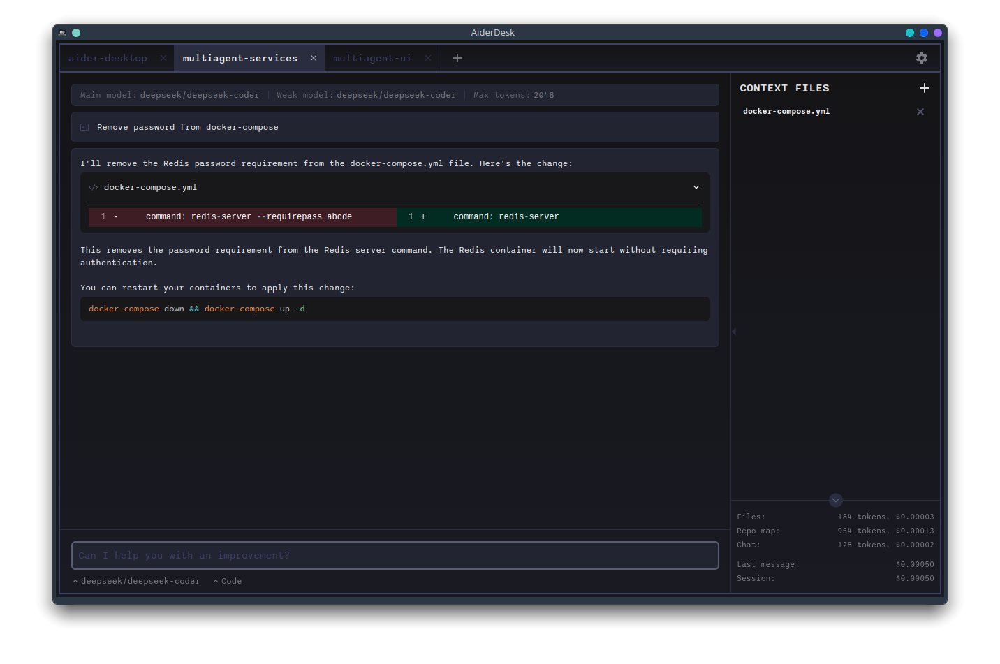
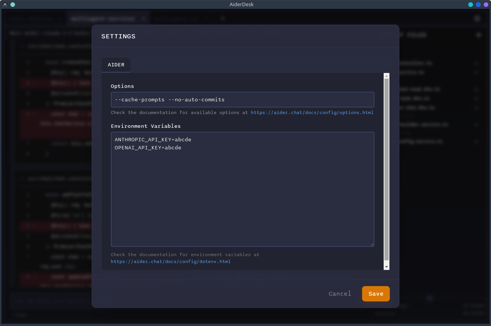
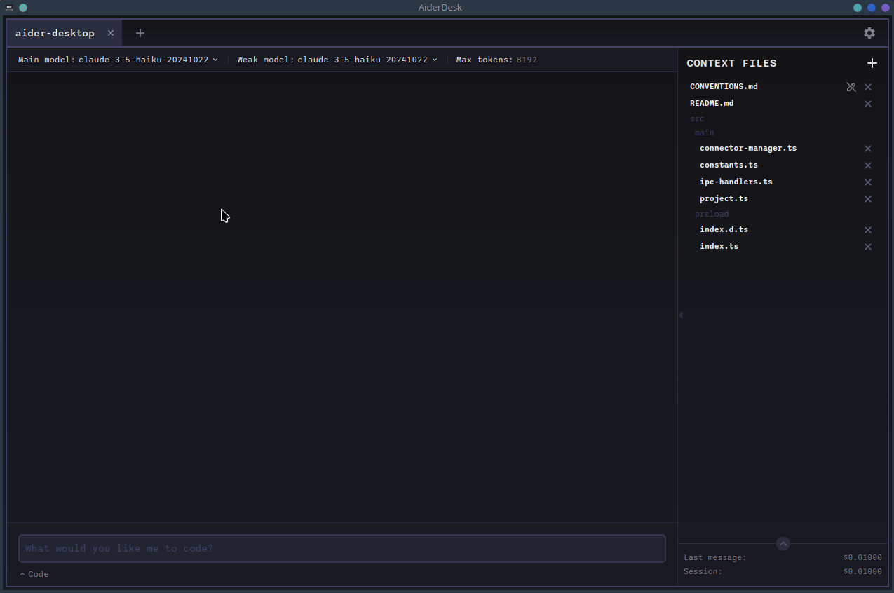
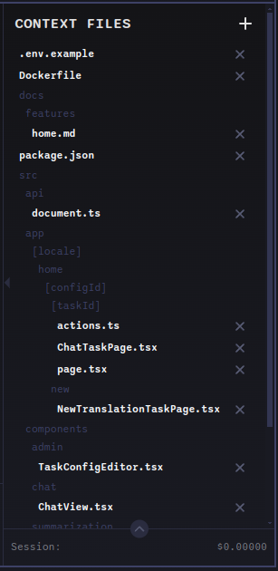
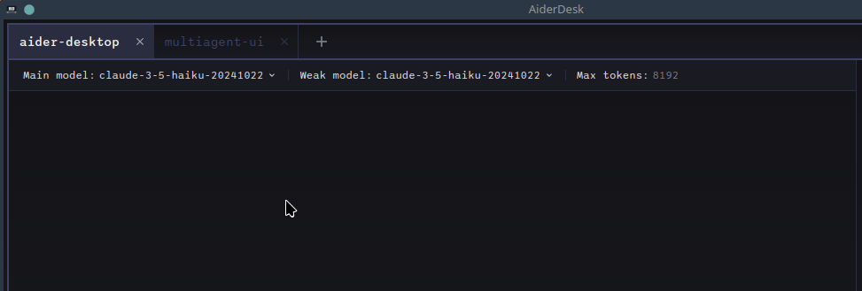
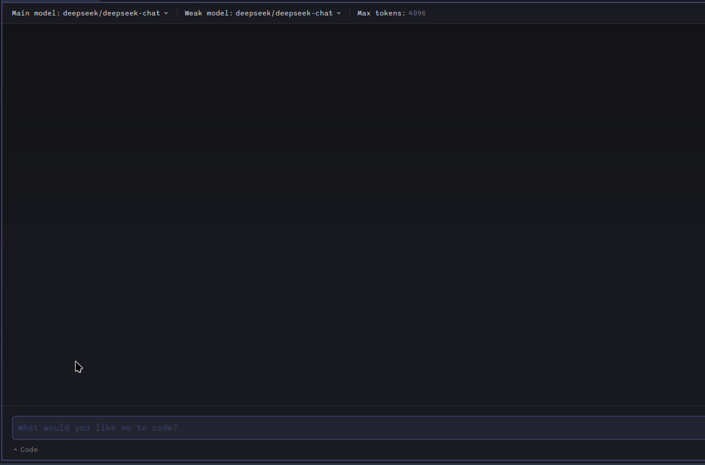
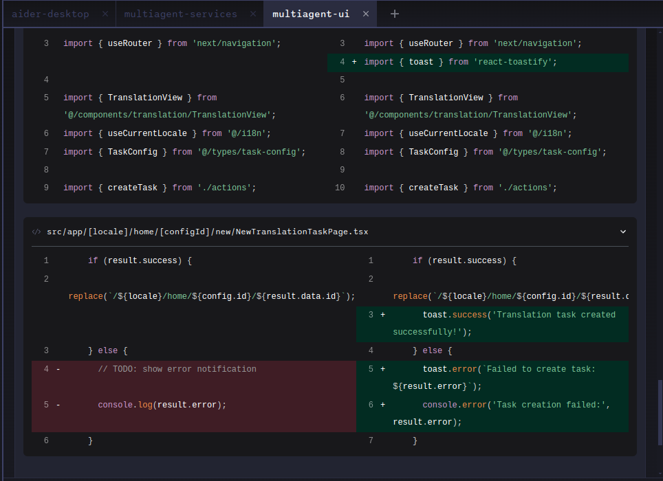
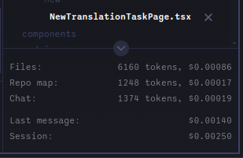

# AiderDesk

Supercharge your coding workflow with AiderDesk, a sleek desktop application that brings the power of [aider](https://aider.chat) to your fingertips. Say hello to a user-friendly GUI, enhanced with project management, cost tracking, and structured message handling. Effortlessly leverage language models to accelerate your code-related tasks and boost your productivity.

## Introduction

Aider, the powerful console-based tool, has long empowered developers with advanced AI capabilities to streamline coding workflows. However, working exclusively in the terminal can sometimes limit accessibility and ease of use. AiderDesk transforms this experience by bringing Aider’s capabilities into a sleek, intuitive desktop application. With AiderDesk, you not only retain all the functionalities of the original console tool but also benefit from a visually enriched environment that simplifies project management, file organization, and cost tracking. Whether you're managing multiple codebases, integrating with popular IDEs, or tracking AI interaction costs, AiderDesk elevates your coding workflow to a new level of efficiency and productivity.

## Key Benefits

*  Intuitive GUI: Replace command-line complexities with a visual interface that is easy to navigate.
*  Automatic context management: Automatically manage your context files using the connector plugins for [IntellijIDEA](https://plugins.jetbrains.com/plugin/26313-aiderdesk-connector)/[VSCode](https://marketplace.visualstudio.com/items?itemName=hotovo-sk.aider-desk-connector)
*  Streamlined Project Management: Organize and work on multiple projects effortlessly.
*  IDE Integration: Automatically manage context files in IntelliJ IDEA and VSCode.
*  Cost Transparency: Track token usage and associated costs with detailed insights.
*  Enhanced Collaboration: Quickly copy, share, and review AI-generated code changes with built-in tools.

## Quick Demo

[](https://www.youtube.com/watch?v=9JkUwn9rk2g)

## Features

This tool provides features you are familiar with from Aider and additionally:

*   **🖥️ Graphical User Interface (GUI)**
    *   Enjoy a user-friendly desktop application with a visual interface, replacing the command-line experience.
*   **📂 Project Management**
    *   Organize and manage multiple codebases as separate projects, allowing for better context and organization.
    *   Easily switch between different projects.
*   **🔌 IDE Integration**
    *   Seamlessly integrate with IntelliJ IDEA and VSCode to automatically manage context files
    *   IntelliJ IDEA [Plugin](https://plugins.jetbrains.com/plugin/26313-aiderdesk-connector)/[GitHub](https://github.com/hotovo/aider-desk-connector-intellij-plugin)
    *   VSCode [Extension](https://marketplace.visualstudio.com/items?itemName=hotovo-sk.aider-desk-connector)/[GitHub](https://github.com/hotovo/aider-desk-connector-vscode-extension)
*   **🔑 Manage Aider Settings**
    *   Manage environment variables for model API keys and other aider settings
*   **💰 Cost Tracking**
    *   Monitor token usage and costs associated with AI interactions, providing transparency and control over expenses.
    *   Gain insights into the expenses of using language models.
*   **📨 Structured Message Handling**
    *   View different types of messages (code, prompts, responses, logs, command outputs) in a clear and organized manner, enhancing readability and understanding.
*   **📄 Enhanced File Management**
    *   Visually add, remove, and manage files within the project context, providing more control over the AI's context.
*   **🔄 Flexible Model Switching**
    *   Easily switch between different language models during a single session
    *   Maintain conversation context when switching models
*   **🔍 Code Diff Viewer**
    *   Easily review AI-generated code changes with an integrated diff viewer
    *   Side-by-side comparison of original and modified code
*   **⏪ Revert Changes**
    *   Undo specific AI-generated changes with a single click
    *   Revert changes that don't meet your expectations while keeping other modifications
*   **📋 Copy and Share**
    *   Quickly copy messages or code changes to clipboard with a single click
    *   Share specific code changes or conversations with team members

## Installation

### Requirements
- Python 3.9-3.12 installed on your system

### Quick Start
1. Download the latest release for your platform from [Releases](https://github.com/hotovo/aider-desk/releases)
2. Run the downloaded executable

### Troubleshooting

#### Python Version Detection

If you encounter issues with the application not detecting the correct Python version, you can specify the path to the desired Python executable using the `AIDER_DESK_PYTHON` environment variable. This is typically only needed on the initial run/setup of AiderDesk.

For example, on macOS or Linux:

```bash
export AIDER_DESK_PYTHON=/usr/bin/python3.10
```

Or on Windows:

```powershell
$env:AIDER_DESK_PYTHON = "C:\Path\To\Python310\python.exe"
```

Replace `/usr/bin/python3.10` or `C:\Path\To\Python310\python.exe` with the actual path to your Python executable.

## Screenshots

### Aider Desk Interface


*Main application interface showing the chat interface, file management, and project overview*

### Configuration


*Aider settings and preferences*

### Multiple Project Management


*Manage and switch between multiple projects*

### Context File Management


*Manage files included in the AI context*

### Model Switching Interface


*Switch between different models*

### Chat Mode Selection


*Switch between different chat modes*

### Question answering and commands running support


*Answer questions and run commands*

### Code Diff Viewer


*Side-by-side code comparison and diff viewer*

### Cost Tracking


*Token usage and cost tracking for session per project*

## Development Setup
If you want to run from source, you can follow these steps:

```bash
# Clone the repository
$ git clone https://github.com/hotovo/aider-desk.git
$ cd aider-desk

# Install dependencies
$ npm install

# Run in development mode
$ npm run dev

# Build executables
# For Windows
$ npm run build:win

# For macOS
$ npm run build:mac

# For Linux
$ npm run build:linux
```

## Contributing

We welcome contributions from the community! Here's how you can help improve aider-desk:

1. **Fork the repository** on GitHub
2. **Create a new branch** for your feature or bugfix:
   ```bash
   git checkout -b my-feature-branch
   ```
3. **Commit your changes** with clear, descriptive messages
4. **Push your branch** to your fork
5. **Create a Pull Request** against the main branch of the original repository

Please follow these guidelines:
- Keep PRs focused on a single feature or bugfix
- Update documentation when adding new features
- Follow the existing code style and conventions
- Write clear commit messages and PR descriptions

For major changes, please open an issue first to discuss what you would like to change.
